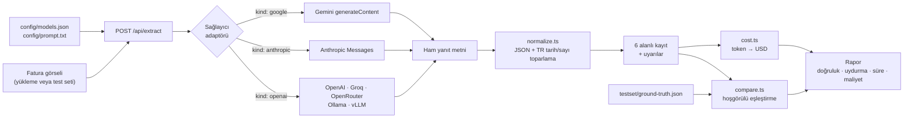

# invoice-llm-benchmark

**Hangi vision LLM, Türk faturalarını en doğru ve en ucuz şekilde okuyor?**
Bu soruyu tahminle değil, ölçerek cevaplayan bir test laboratuvarı.

Aynı faturayı OpenAI, Anthropic, Google, Groq, OpenRouter veya yerel bir Ollama modeline
gönderir; çıkan JSON'u referans değerlerle karşılaştırır; **doğruluk, halüsinasyon, gecikme
ve maliyeti** tek raporda yan yana koyar. Yeni bir model eklemek için kod yazmanız
gerekmez — `config/models.json` içine 8 satır JSON yeterlidir.

> **In English —** A provider-agnostic benchmark harness for vision LLMs doing invoice /
> receipt data extraction in Turkish. It sends the same document to any OpenAI-compatible,
> Anthropic, or Gemini endpoint, forces a shared 6-field JSON schema, normalizes the raw
> output, and scores it against a hand-labelled ground-truth set of 25 real documents.
> Reports accuracy per field, hallucination rate (fields the document does *not* contain),
> latency, token usage and projected cost per 1000 documents. Adding a model or a provider
> is a config change, not a code change. Next.js 16 + TypeScript, no external SDKs.

---

## Neden böyle bir şey lazım?

Fatura/fiş okuma işini bir LLM'e devretmeye karar verdiğinizde asıl soru "çalışıyor mu"
değil, şunlardır:

- Hangi model **hangi alanda** hata yapıyor? (tarih mi, toplam tutar mı, satıcı adı mı?)
- Model belgede **olmayan** bir fatura numarasını uyduruyor mu?
- Buruşuk, yan yatmış, nokta vuruşlu bir belgede doğruluk ne kadar düşüyor?
- 1000 belge işlersem faturam ne olur — ve bu doğruluk farkına değer mi?

Sağlayıcıların kendi benchmark'ları bu soruların hiçbirini Türkçe belgeler için
cevaplamıyor. Bu proje, kendi belgelerinizle kendi cevabınızı üretmeniz için var.

## İki test modu

| Mod | Ne yapar | Ne zaman |
|---|---|---|
| **Tekli Test** (`/`) | Bir faturayı **birden çok modele aynı anda** gönderir, çıktıları yan yana koyar | "Bu zor fişi hangi model okuyabiliyor?" |
| **Toplu Test** (`/toplu`) | **Tek modeli** tüm test seti üzerinde sırayla çalıştırır, rapor üretir | "Gemini Flash 25 belgede kaç puan alıyor, nerede hata yapıyor?" |

## Öne çıkanlar

- **Sağlayıcı-bağımsız adaptör katmanı.** OpenAI uyumlu API'ler (Groq, OpenRouter, xAI,
  Together, vLLM, LM Studio, Ollama…) tek adaptörden geçer; Anthropic ve Gemini'nin kendi
  protokolleri için ikişer küçük adaptör var. SDK bağımlılığı yok, ham HTTP.
- **Konfigürasyonla model ekleme.** Yeni model = `models.json`'a bir kayıt. Yeni sağlayıcı =
  `providers`'a bir kayıt (OpenAI uyumluysa). Sunucuyu yeniden başlatmaya bile gerek yok.
- **Üç yapısal çıktı modu.** `json_schema` (şema API tarafından zorlanır), `json_object`
  veya serbest metin. Şema, üç sağlayıcının ortak paydasında kalacak şekilde tasarlandı;
  Gemini'nin OpenAPI lehçesine otomatik çevriliyor.
- **Normalize katmanı her zaman devrede.** Markdown kod bloğu, `"1.234,56 TL"`, `07.03.2026`,
  `"FATURA NO: PF-004"`, iç içe sarmalanmış JSON… hepsi toparlanır. **Yapılan her düzeltme
  uyarı olarak raporlanır** — yani "hangi model ham haliyle temiz çıktı veriyor" da ölçülür.
- **Halüsinasyon ayrı bir metrik.** Referansta `null` olan alan "belgede gerçekten yok"
  demektir; doğruluk skoruna girmez ama model oraya bir şey yazarsa *uydurma* olarak sayılır.
  Doğruluğu yüksek ama uydurmacı bir modeli bu sayede yakalarsınız.
- **Hoşgörülü karşılaştırma.** Ünvan ekleri, Türkçe karakterler, baştaki sıfırlar ve kuruş
  yuvarlaması tolere edilir — ölçtüğümüz şey yazım farkı değil, gerçek okuma hatası.
- **25 belgelik tuzaklı test seti**, referans değerleri elle hazırlanmış olarak gelir.
- **Excel-TR uyumlu rapor.** Noktalı virgül + BOM + virgüllü ondalık; sayılar metin değil
  sayı olarak açılır. Tam rapor / belge tablosu / ham JSON olarak indirilebilir.
- **Free tier'a saygılı.** Model başına `rpm` tanımlı; belgeler arası bekleme otomatik
  önerilir, geçici hatalar üstel bekleme ile 3 kez denenir, kota hataları denenmez.
- **Anahtar güvenliği.** API anahtarları yalnızca sunucuda okunur; arayüz sadece
  "anahtar var/yok" bilgisini görür, debug panelinde başlıklar maskelenir.

## Nasıl çalışır?



Çıkarılan alanlar: `tarih` · `fatura_no` · `sirket_adi` · `toplam_tutar` · `tur` (puanlanır)
ve `aciklama` (serbest metin, puanlanmaz).

## Rapor neye benziyor?

Aşağıdaki tablo **biçimi göstermek için uydurulmuş örnek bir çıktıdır** — gerçek bir ölçüm
değildir. Kendi sayılarınızı `npm run dev` → Toplu Test ile üretirsiniz:

```
Alan doğruluğu      92,0 %     (115 / 125 alan)
Tam doğru belge     19 / 25
Uydurma             1 alan     (belgede yok, model yazdı)
Belge başı maliyet  0,003800 USD
1000 belge          3,80 USD
Ortalama süre       2,34 sn

ALAN BAZLI HATA DÖKÜMÜ
Alan          Doğru  Yanlış  Eksik  Uydurma  Doğruluk (%)
Tarih            23       1      1        0          92,0
Fatura No        22       1      1        1          91,7
Şirket Adı       24       0      0        0         100,0
Toplam Tutar     23       2      0        0          92,0
Tür              23       2      0        0          92,0
Açıklama          —       —      —        —   puanlanmaz
```

## Kurulum

Gereksinim: **Node.js 20.9+** (başka hiçbir şey yok — veritabanı, Docker, SDK, derleme adımı yok).

```bash
git clone <repo-url>
cd invoice-llm-benchmark
npm install
```

API anahtarlarınızı girin:

```bash
cp .env.example .env.local
```

`.env.local` içine elinizdeki anahtarları yazın — **tek bir anahtar bile yeter**, anahtarı
olmayan sağlayıcıların modelleri arayüzde "anahtar yok" rozetiyle pasif görünür:

```
OPENAI_API_KEY=sk-proj-...
ANTHROPIC_API_KEY=sk-ant-...
GOOGLE_API_KEY=AIza...
```

Sunucuyu başlatın:

```bash
npm run dev
```

→ **http://localhost:4123**

### Kurulumu doğrulayın (API harcamadan)

```
http://localhost:4123/api/selftest
```

Ayrıştırma, normalizasyon, puanlama, toplu test özeti, maliyet hesabı, anahtar maskeleme,
Gemini şema dönüşümü ve test setinin yüklenmesini **hiçbir dış çağrı yapmadan** test eder.
`{"passed":21,"total":21,"failed":[]}` görüyorsanız kurulum sağlam.

## Test seti

`testset/images/` altında 25 belge, referans değerleriyle birlikte gelir:

| Grup | Adet | İçerik |
|---|---|---|
| `market-01…07` | 7 | Telefonla çekilmiş buruşuk/eğik/yan yatmış gerçek fişler ve POS slibi |
| `web-01…10` | 10 | Düzgün taranmış proforma faturalar, teklifler, ticari faturalar |
| `efatura-01…08` | 8 | Kurumsal e-Fatura / e-Arşiv çıktıları, elektrik-su-doğalgaz faturaları |

Set bilinçli olarak **tuzak** içerir: fatura numarası olmayan belgeler, boş bırakılmış
etiketler, satıcı yerine alıcıyı yazdırmaya çalışan düzenler, aynı numarayı taşıyan iki
farklı fatura, filigranlar, uygulama ekran görüntüleri, 2002 tarihli nokta vuruşlu bir
doğalgaz faturası. Amaç "okuyabiliyor mu"yu değil, **"doğru alanı seçebiliyor mu"yu** ölçmek.

## Proje yapısı

```
config/
  models.json          sağlayıcı + model + fiyat tanımları (tek gerçek kaynağı)
  prompt.txt           sistem prompt'u (Türkçe, yorumlu)
testset/
  images/              25 belge
  ground-truth.json    referans değerler + tuzak notları
src/lib/
  providers/           openai.ts · anthropic.ts · google.ts (ham HTTP adaptörler)
  schema.ts            ortak JSON şeması + alan sözlüğü
  normalize.ts         ham metin → 6 alan
  compare.ts           referansla hoşgörülü karşılaştırma ve puanlama
  batch.ts             toplu test özeti + rapor tabloları
  cost.ts              token → maliyet, 1000 belge projeksiyonu
src/app/
  page.tsx             Tekli Test
  toplu/page.tsx       Toplu Test
  api/                 extract · models · testset · selftest
```

## Dokümantasyon

Kurulumdan sonrası, model ekleme, parametre ayarlama, puanlama mantığı, mimari ve sorun
giderme için: **[REHBER.md](REHBER.md)**

## Teknoloji

Next.js 16 (App Router) · React 19 · TypeScript (strict) · sıfır çalışma zamanı bağımlılığı
— sağlayıcı SDK'ları yerine ham `fetch`, harici CSS/UI kütüphanesi yerine tek bir
`globals.css`.

## Lisans

[MIT](LICENSE) © Barış Yeşildağ
